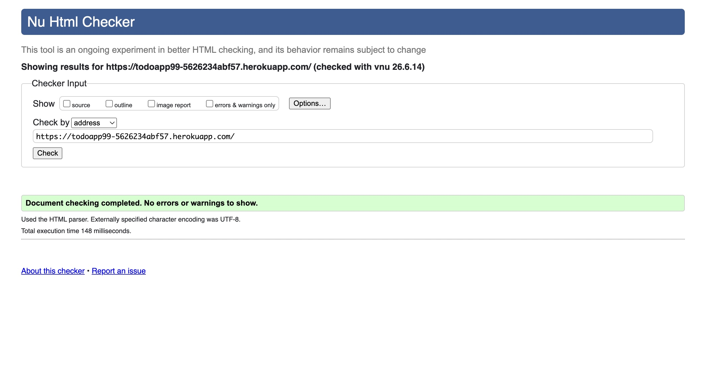
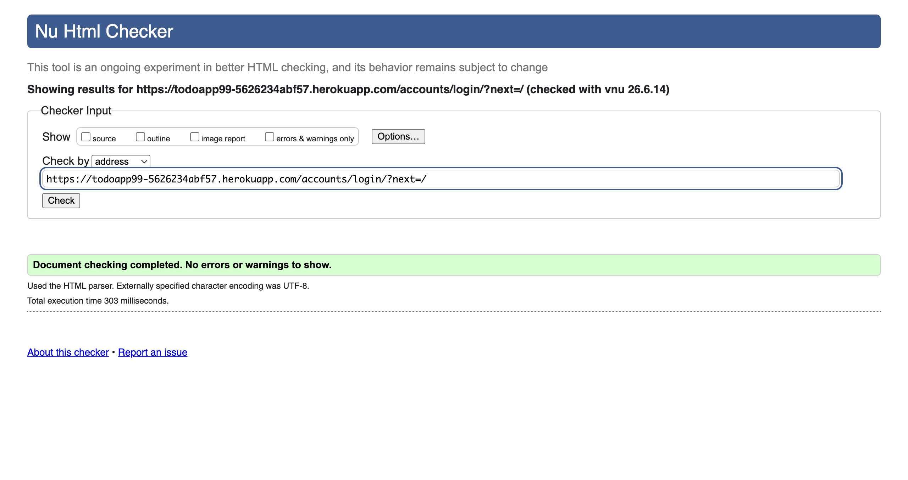
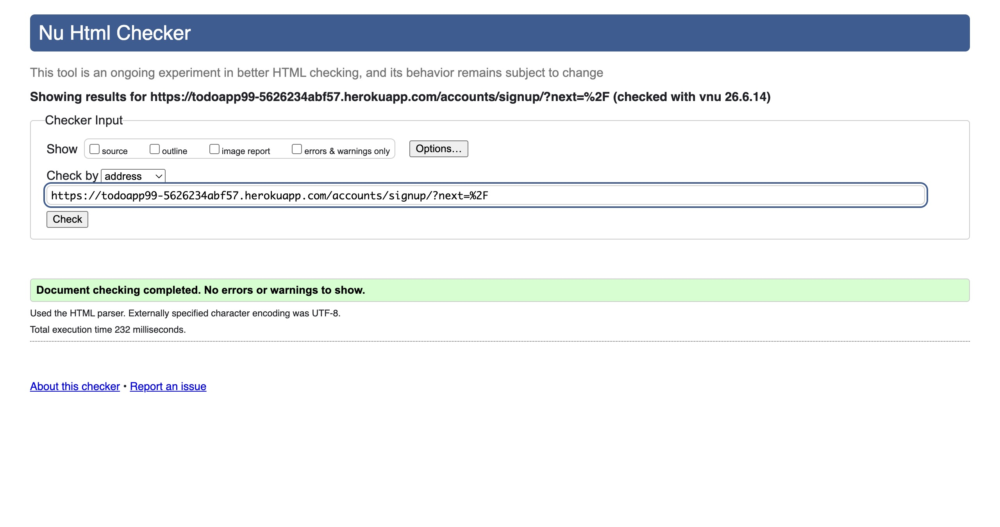
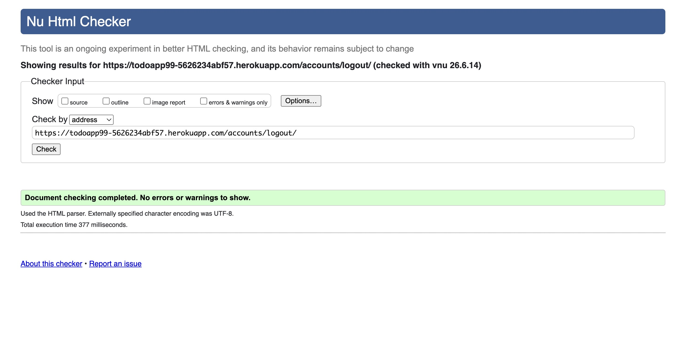
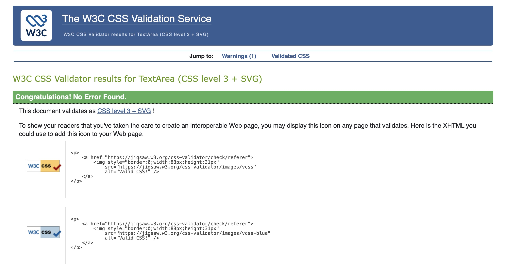
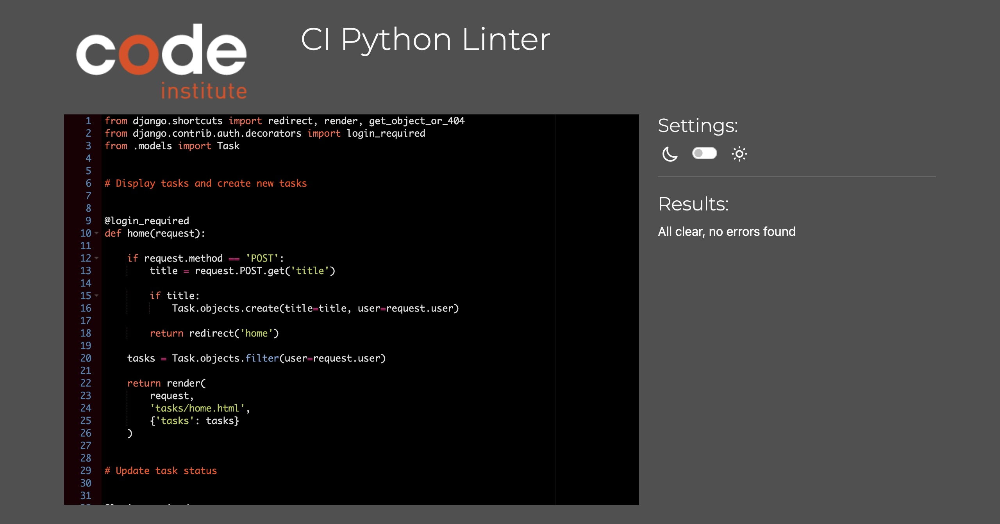
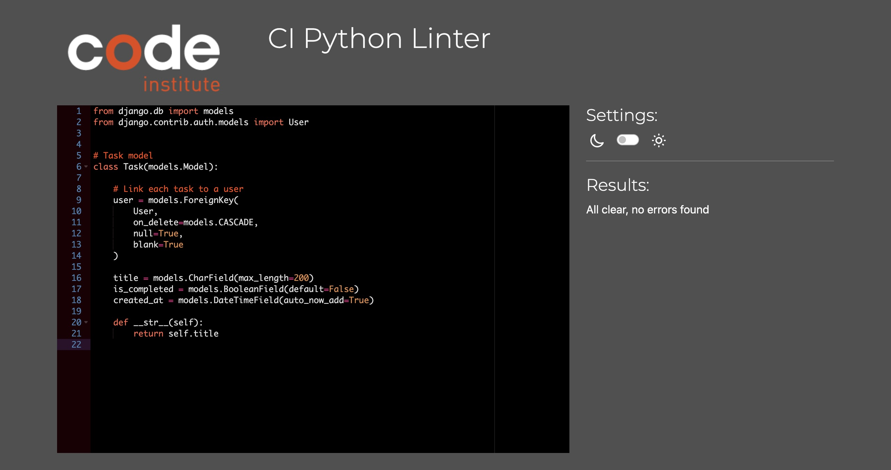
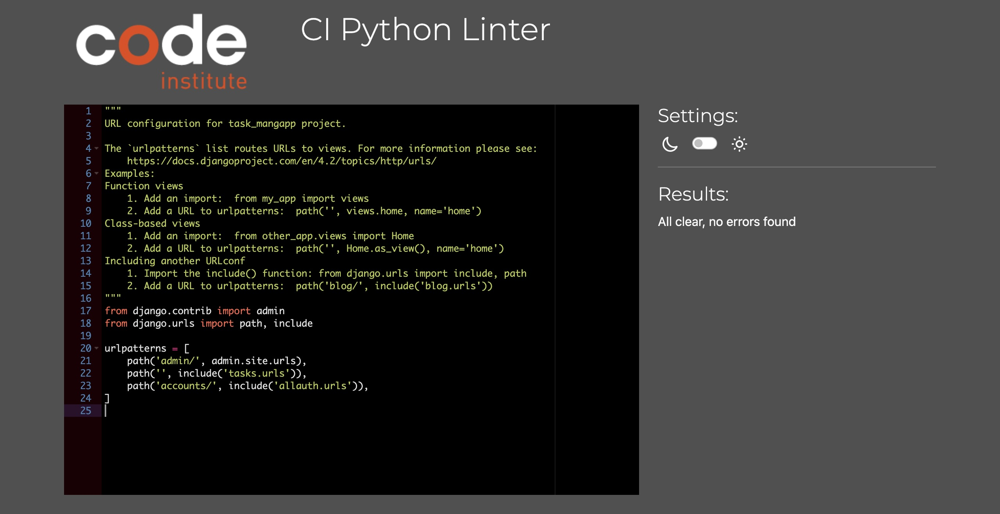
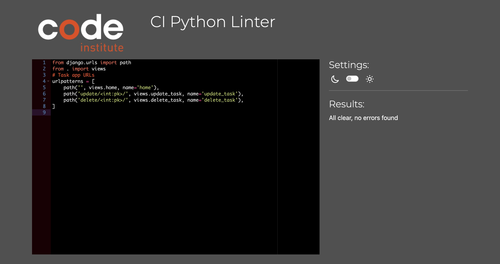

# To Do Tasks App

ِTo Do Tasks App is a task management web application built with Django, Python, HTML and CSS. The application allows users to create an account, log in securely, and manage their personal tasks. Users can add new tasks, update task status, delete, and keep track pf completed and panding tasks. Each user can only access their own tasks, ensuring privacy and security.
[Livewibsite](https://todoapp99-5626234abf57.herokuapp.com/)

# Features section

- To Do page desktop

- To Do login desktop

- To Do signup desktop

- To Do logout desktop
 

- To Do page mobile

- To Do login mobile

- To Do sign up mobile

- To Do logout mobile

- To Do page tablet

- To Do login tablet 

- To Do sign up tablet 

- To DO logout tablet

- To Do page
.To Do page allows users to manage their tasks. Users can add new tasks, update and delete existing task. The page also display the current user,s task list.

- To Do login
the login page allows registered users to access their personal task. Users must enter their username and password to log in.

- To Do sign up 
the sign up page allows new users to create an account. After registratic, users can log in and manage their own tasks.

- To Do logout
the logout page allows users to securely end their session and protect their account information. 

- To Do addtask Feature 
Users can create new tasks using the task input field and the add button. New tasks are displayed immediatley in the task list. 

- To Do update feature 
Users can update the status of a task by clicking the update button. Tasks can be marked as done or not done. 

- To Do delete feature
Users can remove tasks from the list by clicking the delete button.

# User Experience (UX)
- User story 1: create an account
As a user i want to create an account so that i can manage my own tasks.

- Acceptance Criteria 

1. The sign up page is accessible.
2. The user can create a new account.
3. The user can log in using the created account.

- User story2: login
As a user i want to log in so that i can access my personal task list.

- Acceptance Criteria
1. The login page is working.
2. The user can enter valifd credentials.
3. The user is redirected to the task list after login.
4. The username is displayed after authentication.

- User Story3: add a task
As a user i want to add a task so that i can keep track of my work.

- Acceptance Criteria 

1. A task input field is displayed. 
2. The user can enter a task title.
3. Clicking the add task button creates a new task.
4. The new task appears in the list. 

- Users story4: View Tasks
As a user i want to view my task so that i can see what needs to be completed.

- Acceptance Criteria

1. All tasks are displayed in a task list.
2. Task status is visible.
3. The layout is easy to read.
4. Tasks are organised clearly. 

- Users story5: Update task status

As a user i want to update a task so that i can track completed and pending tasks. 

- Acceptance Criteria 
1. An Update button is diplayed.
2. Clicking Update changes the task status.
3. The new status is displayed immediately.
4. The task remains in the task list.

- Users story6: delete a task 
As a user i want to delete tasks that are no longer needed so that my task list stays organised.

- Acceptance Criteria 

1. A delete button is displayed.
2. Clicking delete removes the task.
3. The deleted task no longer appears
4. only the owner can delete their tasks.

- Users story7 :logout

As a user i want to logout so that my account remains secure.

- Acceptance Criteria 
1. A logout button is available. 
2. The logout page is working
3. The user can end the session successfully.
4. Protected pages require login again after logout.

- User story8 : user privacy 
As a user I want to see only my own tasks so that my information remains private.

- Acceptance Criteria 

1. Users only see their own tasks.
2. Tasks are linked to the logged-in account.
3. One user cannot access another users tasks.
4. Data remains private between accounts.

# Technologies Used 
## Languages 
- python
- HTML5
- CSS
## Framework
- Django 4.2
## Database
- postgreSQL
## Libraries and Tools
- Bootstrap 5
- Django AlLAuth
- WhiteNoise
- dj-database-url
- git
- github
- Heroku 
- Vs code
- Google Fonts
- chrome devtools
- Balsamiq wireframes 

# Manual testing 

| Feature               | Action                                                        | Result |
| --------------------- | ------------------------------------------------------------- | ------ |
| Sign Up               | Created a new account using the registration form.            | Pass   |
| Login                 | Logged in with a registered account.                          | Pass   |
| Logout                | Clicked the Logout button and ended the session.              | Pass   |
| Add Task              | Added a new task using the task form.                         | Pass   |
| View Tasks            | Verified tasks are displayed correctly.                       | Pass   |
| Update Task           | Clicked the Update button and changed task status.            | Pass   |
| Delete Task           | Clicked the Delete button and removed a task.                 | Pass   |
| User Privacy          | Verified users can only see their own tasks.                  | Pass   |
| Responsive Design     | Tested the application on desktop, tablet and mobile screens. | Pass   |
| Browser Compatibility | Tested the application in Chrome, Safari and Firefox.         | Pass   |
| Console Errors        | Checked browser console for errors.                           | Pass   |

# Validator 
## HTML Validator
- HTML To Do page 

- HTML To Do login 

- HTML To Do sign up

- HTML To Do logout

## CSS Validator
- CSS 

## Python Validator 
- python view

- python model

- python url

- python url 

# Database diagram
 The project uses Django built-in User model and a custom task model.
 Each task belong to one user-through a ForeignKey relationship. A user can create, update and delete multiple tasks, while each task can only belong to one user. 
 

## Browser and device test
1. Desktop (≥1024px): Chrome, Safari
2. Tablet (768px): Chrome, Safari
3. Mobile (≤375px): Chrome, Safari

## Lighthouse (crhomedevtools)
1. Best Practice : 100
2. Accessibility: 93
3. Performance : 95
4. SEO : 90

# Development Cycle 
## planning Phase
I started by defining the project goal wich was to build a task management application. I identified the main features required such as user authentication, task creation, task updates, task deletion, and user privacy. I also created user stories to guide the development process.

## Design Phase
I created simple wireframes for the main pages of the application, including the Home page, Login page, Sign Up page and Logout page. The focus was on creating a simple and easy to use interface.

## Development Phase
I built the application using Django, Pyhton, HTML and CSS. Bootstrap was used to help create a responsive layout. Django allauth was used to implement user authentication. Tasks were linked to authenticated users through a ForeignKey relationship.

## Testing Phase
I tested the application manually on different screen sizes and browsers. I also used HTML, CSS and python validators to check code quality. Lighthouse was used to check performance, accessibility and best practice.

## Debugging and improvement
I fixed several issues during development, including:
- Login and logout navigation problem.
- User authentication display issues.
- Static files not loading correctly after deployment.
- improvved the layout and styling to provide a better user experience.

# Deployment 
This ptoject was deployed to heroku from a github repository.

## Creating GitHub Repository
1. i clicked on new repository for the project to create it.
2. I added my Django project files to the repository.
3. I used Git commands to add, commit and push the project file to github.

## Creating the heroku App
1. I signed in to heroku .
2. I clicked new and selected create new app.
3. I entered the app name.
4. I selected the Europe region.
5. I clicked create app.

## Preparing the Project for Deployment
1. I installed Gunicorn:
pip3 install gunicorn
2. I updated the requirements file:
pip3 freeze > requirements.txt
3. I created a Procfile in the root directory of the project.
4. Incide the Procfile, I added:
web: gunicorn task_mangapp.wsgi
5. I added Heroku to ALLOWED_HOSTS in setting.py:
ALLOWED_HOSTS = [
    '127.0.0.0.1',
    '.herokuapp.com',
]
6. I configured static files using WhiteNoise and STATIC_ROOT.

## Heroku Config Vars 
In the Heroku Setting tab, I clicked Reveal Config Vars and added the required environment variables. 

## Deploying on heroku 
1. I opened the deploy tab in heroku.
2. I selected GitHub as the deployment method.
3. I searched for my GitHub repository and connected it to heroku.
4. I clicked deploy branch to manually deploy the project.
5. After the buld finished, i opened the deployed app and tested the main features.
[the-link](https://todoapp99-5626234abf57.herokuapp.com/)

# Bugs and Fix 

1. Bug: Login button was displayed after the user logged in.
1. cuase: The authentication condition in the template was incorrect.
1. Fix: Fixed the authentication condition in the template using user.is_authenticated.

2. Bug: Static files were not loading correctly after deployment.
2. cause: Static files were not configured correctly for the production environment.
2. Fix: Configured WhiteNoise, STATIC_ROOT and run collectstatic.

3. Bug: PEP8 validation reported formatting issues. 
3. cause: some Python files contained spacing, blank line and line length issues.
3. Fix: Fixed spacing, blank lines and line length
issues according to PEP8 guidelines.

4. Bug: HTML validator showed errors with Django templates files directly. 
4. cause: Django template tags were interpreted as invalid HTML by the validator.
4. Fix: Validated the rendered HTML from the browser instead of the raw Django template files.

5. Bug: Login and logout button were not working correctly after authentication changes.
5. cause: Template condition and authentication URL configuration were not set corrrectly 
5. Fix: Corrected template conditions and 
authentication URL configuration.

# Wireframes
this is the wireframes for the application tablet, mobile and desktop
## To Do section

## To Do Login

## To Do Sign up

# Credits 

## Content and design  inspiration
The goal of the To Do Tasks App project was to create a simple responsive and user friendly task management application. The main focus was to allow users to manage their tasks easily while maintaining privacy through user authentication. 

## Interface and layout 
I followed simple design approach to make the application easy to use and navigate. The task form buttons and task list are clearly displayed and accessible across diffrenet devices (desktop, tablet and mobile)

## Libraries and tools 
- Django AllAuth

I used Django AllAuth to implement user registration, login and logout funcionality.

- WhiteNoise
I used whitenoise to serve static files correclty after deployment.

- Google font 
I used google font to apply the "black Ops One" font throughout the application and improve the visual appearance of the interface.

- Django 
I used Django as the main framework to build the application, handle routing models views and users authentication.

- Heroku 
I used heroku to deploy and host the project online 

- GitHub 
I used GitHub for version control and ptoject managment. 

about Ai
I used AI (copilot) durong the development of this project strictly as a learning tool to help understand.
all code in the project was written modifided and fully understood by me. No Ai generated code was copied directly into the project. AI was only consulted in specific situations to help identify issues
i remain fully responsible for the project's structure, code decisions and final implementation.

